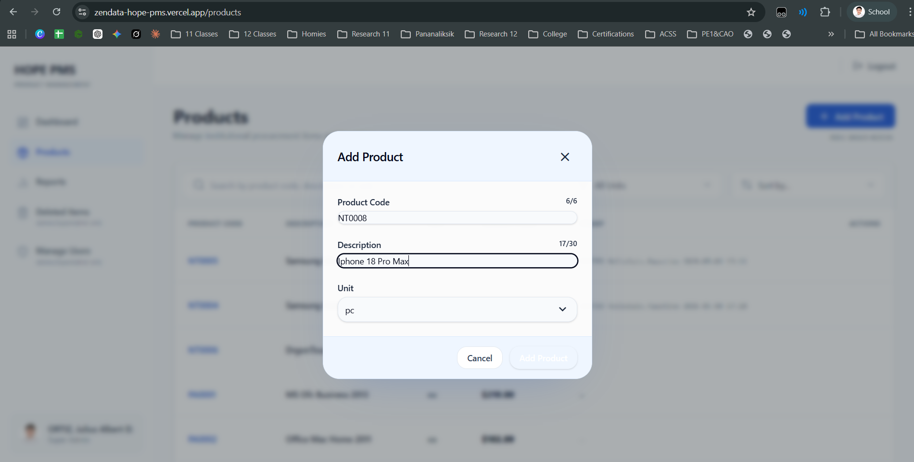
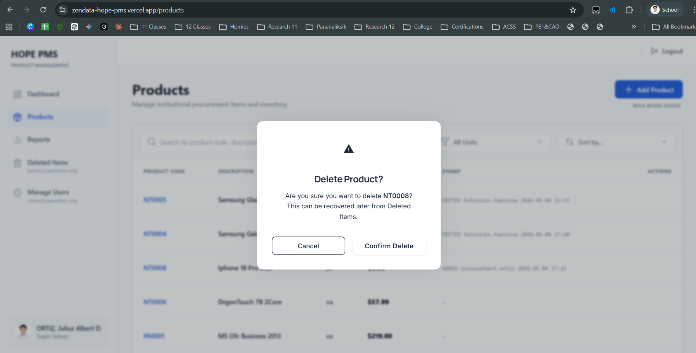
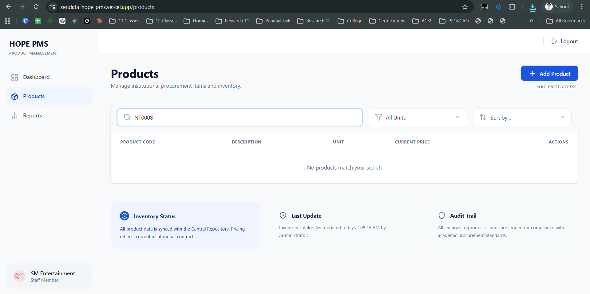
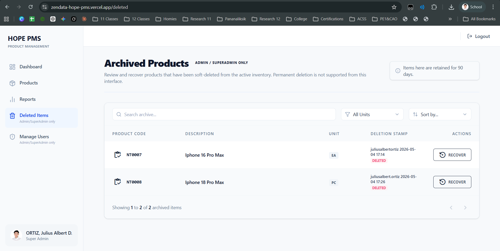
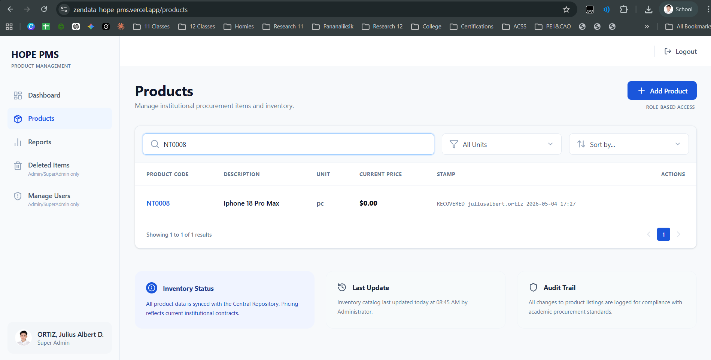
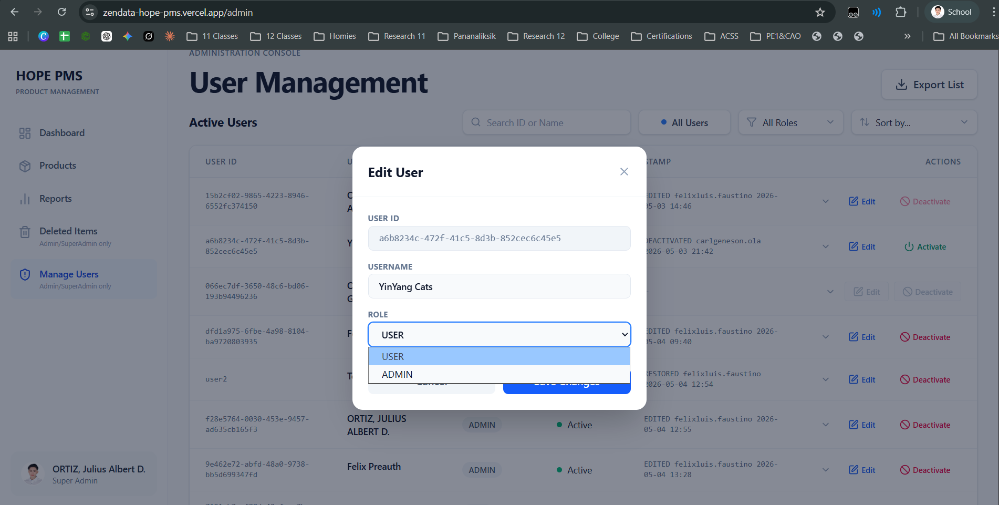

# HOPE PMS: Comprehensive User Manual & Documentation

**System Version:** 1.0 (Production Build)

**Release Date:** May 2026

**Prepared By:** QA / Documentation Specialist

---

## Table of Contents
1. [System Overview & User Roles](#1-system-overview--user-roles)
2. [Accessing the System](#2-accessing-the-system)
3. [Inventory Management](#3-inventory-management)
4. [Data Integrity & Archiving (Soft-Deletes)](#4-data-integrity--archiving-soft-deletes)
5. [Administration & Security](#5-administration--security)

---

## 1. System Overview & User Roles

The Hope, Inc. Product Management System is a web-based application where authorized users manage products and price history from the HopeDB database. All access is dynamically gated by the Rights Management schema. The system enforces rights using a 3-tier hierarchy: SUPERADMIN, ADMIN, and USER.

### 1.1 User Type Definitions
*   **SUPERADMIN:** Full system access. Cannot be modified by any other user.
*   **ADMIN:** Product and report management. Can activate/deactivate USER accounts. Cannot touch SUPERADMIN records.
*   **USER:** Standard registered user. Can add and edit products, view reports. Cannot delete or access admin functions.

### 1.2 The Access Matrix
| Right / Feature | SUPERADMIN | ADMIN | USER |
| :--- | :---: | :---: | :---: |
| **Add Product** | YES | YES | YES |
| **Edit Product** | YES | YES | YES |
| **Soft Delete Product** | YES | NO | NO |
| **Product Report Listing** | YES | YES | YES |
| **Top Selling Report** | YES | NO | NO |
| **Activate / Manage Users** | YES | NO | NO |

---

## 2. Accessing the System

The application supports two sign-in methods: Email/Password and Google OAuth. Both methods go through the same post-registration provisioning and admin activation pipeline before a user can access the app.

### 2.1 First-Time Login & Auto-Provisioning
1. Navigate to the live HOPE PMS web portal.
2. Click the **"Continue with Google Account"** button or enter your email credentials.
3. Users who register via Google follow the same auto-provisioning and activation flow as email registrants.
4. **Auto-Provisioning:** The user is provisioned as USER / INACTIVE regardless of how they signed up.
5. **Activation:** Account is INACTIVE until an ADMIN or SUPERADMIN activates it. 

*Fig 1.1: The Secure Login Portal*

*Fig 1.2: Google Account Selection Prompt*

---

## 3. Inventory Management

The **Products** module is the core of the PMS. Authorized users can Add, Edit, Soft-Delete, and View products and price history.

### 3.1 Adding and Editing a Product
1. To add a product, click the **"+ Add Product"** button. The modal includes fields for product code (e.g., AK0001), description, and unit. 
2. To edit an existing product, hover your mouse over the row to reveal the **Actions** column, then click the **Pencil Icon**.

*Fig 3.1: Creating a new product entry.*

### 3.2 Audit Trail (Stamp) Visibility
The system features an audit trail (stamp) that records who performed an action and when.
*   Stamp values (audit trail strings) are hidden from USER accounts in all views. 
*   Only SUPERADMIN and ADMIN can see stamp columns.

*Fig 3.2: Product list view. Stamp column is visible to Admin/Superadmin.*

---

## 4. Data Integrity & Archiving (Soft-Deletes)

To maintain strict data integrity, the application must NEVER issue a DELETE statement. 

### 4.1 Deleting a Product
1. Hover over a product row and click the **Trash Can Icon**.
2. All removals are soft-deletes: set record_status = 'INACTIVE'.
3. The item is immediately removed from the active view.

*Fig 4.1: The soft-delete confirmation safeguard.*

### 4.2 Standard User Visibility Block
*   INACTIVE (soft-deleted) records are INVISIBLE to USER accounts. 
*   Users see only record_status = 'ACTIVE' rows at all times — in queries, lists, and search results.

*Fig 4.2: Standard User account securely restricted from viewing deleted inventory.*

### 4.3 Recovering Archived Items
*   Only ADMIN and SUPERADMIN can see INACTIVE records.
*   Only ADMIN and SUPERADMIN can recover (reactivate) a soft-deleted record by setting record_status back to 'ACTIVE'.
*   Navigate to the **Deleted Items** tab, locate the archived product, and click **Recover**.

*Fig 4.3: The secure recovery console.*

*Fig 4.4: Audit trail tracking the recovery action.*

---

## 5. Administration & Security

System administration is handled in the **Manage Users** tab, accessible by Superadmins.

### 5.1 Assigning and Elevating Roles
Superadmins can modify user permissions. Use the **Role** dropdown in the Edit User modal to update the rights tier.

*Fig 5.1: Assigning matrix permissions.*

### 5.2 The Superadmin Protection Protocol
*   ADMIN cannot alter the rights or user_type of a SUPERADMIN account. 
*   This restriction must be enforced at both the UI and database (RLS policy) levels.
*   If an Admin attempts to modify a Superadmin, the UI will disable the buttons and trigger a security notification.

*Fig 5.2: System actively blocking an Admin from modifying a Superadmin account.*

---
*End of Document*