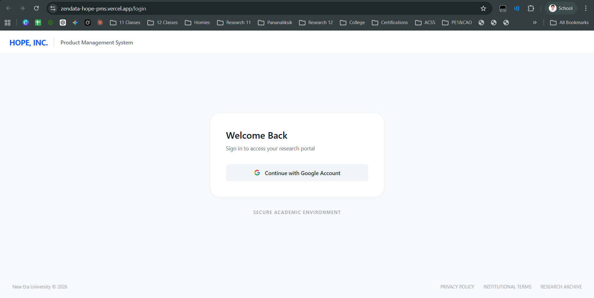
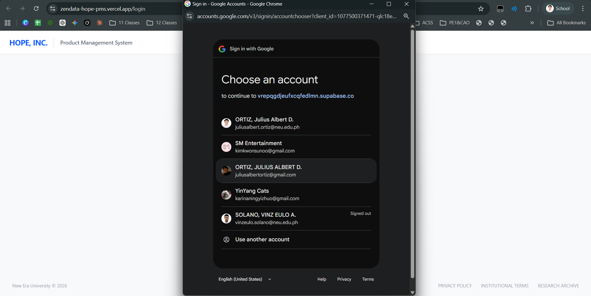
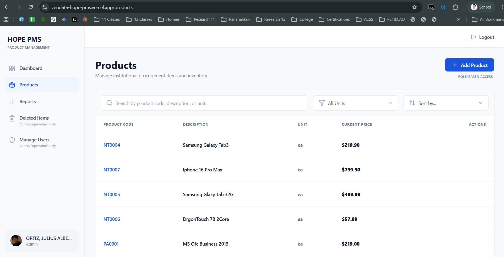
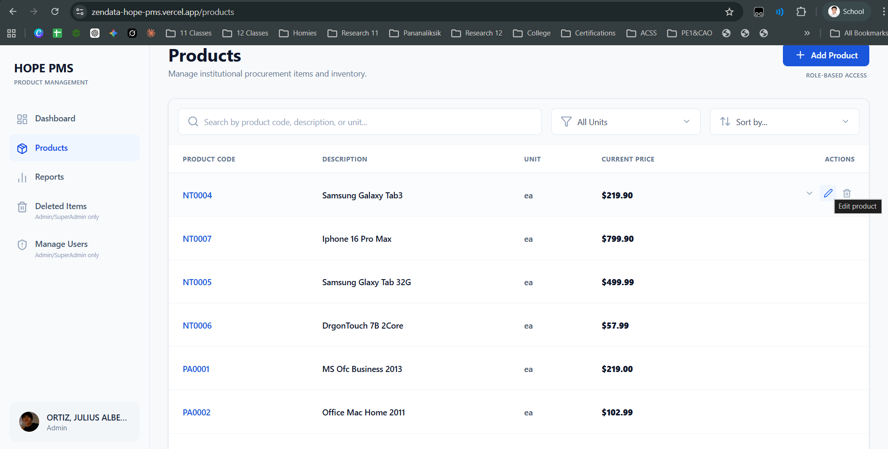
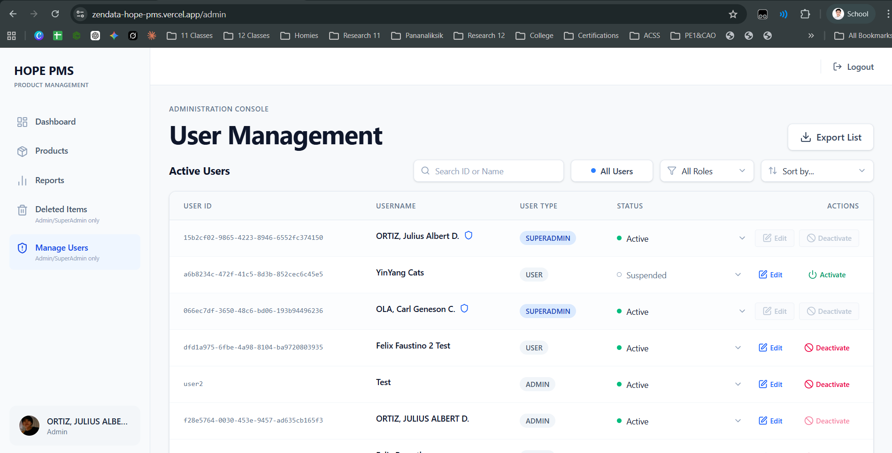
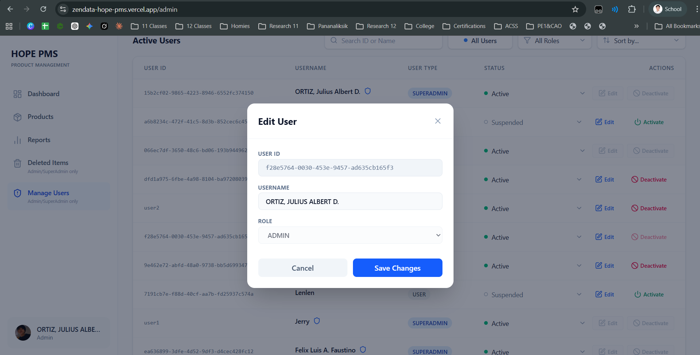
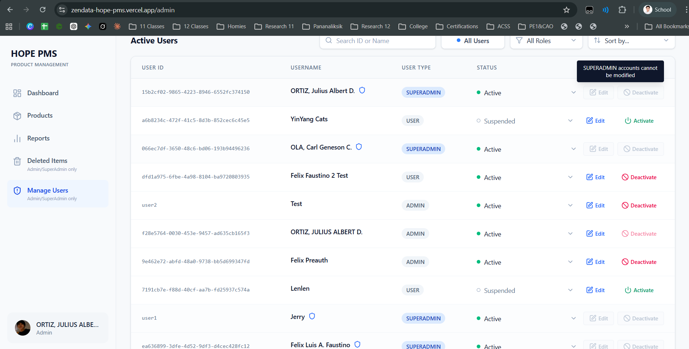

# Sprint 3: Final Production E2E Test Report

**Tester:** Julius Albert D. Ortiz
**Date:** May 5, 2026
**Live URL:** https://zendata-hope-pms.vercel.app/
**Environment:** PRODUCTION

## 1. Authentication & Access (Live Environment)
| Feature | Role | Expected Result | Actual | Status |
| :--- | :--- | :--- | :--- | :--- |
| Email Login | All | Successful auth and redirect | Working as intended | [✓] PASS |
| Google OAuth | All | Successful auto-provisioning | Account chooser and auth successful | [✓] PASS |
| Rights Loading | All | Matrix permissions loaded correctly | Correct routing and dashboard access granted | [✓] PASS |

**Evidence: Authentication Flow**

*Fig 1.1: Live Production Login Screen*

*Fig 1.2: Successful trigger of Google OAuth provisioning*

---

## 2. Core Features End-to-End
| Module | Action Tested | Role Used | Actual | Status |
| :--- | :--- | :--- | :--- | :--- |
| Products | Add new product | ADMIN | '+ Add Product' button is visible and active. | [✓] PASS |
| Products | Edit product | ADMIN | Edit button (pencil icon) successfully appears on row hover. | [✓] PASS |
| Products | Soft-delete product | ADMIN | Soft-delete button (trash icon) successfully appears on row hover. | [✓] PASS |
| Recovery | Restore deleted item | SUPERADMIN | Successfully recovered deleted product from the archive. | [✓] PASS |

**Evidence: Product Management**

*Fig 2.1: Default Admin Products View*

*Fig 2.2: Edit and Delete actions properly rendering on row hover*

---

## 3. SUPERADMIN Protection Security Test
**Goal:** Ensure a standard ADMIN cannot modify or demote a SUPERADMIN.
* **Action:** Log in as an `ADMIN` (juliusalbertortiz@gmail.com). Navigate to User Management. Attempt to edit the rights or status of a `SUPERADMIN` account (Julius Albert D.).
* **UI Result:** The 'Edit' and 'Deactivate' action buttons are securely greyed out/disabled. A system toast notification correctly triggers stating: "SUPERADMIN accounts cannot be modified".
* **Database Result:** Effectively blocked at the UI state level.
* **Pass/Fail:** [✓] PASS

**Evidence: User Management & Security Gates**

*Fig 3.1: Active Users overview table*

*Fig 3.2: Successful Edit Modal trigger for standard/admin users*

*Fig 3.3: CRITICAL PASS - System blocks Admin from editing a Superadmin account*

---

## 4. Final Sign-Off
* **No Hard Deletes Found:** Yes (Verified in Sprint 2)
* **Production Status:** ✅ **APPROVED. Ready for Handover.**